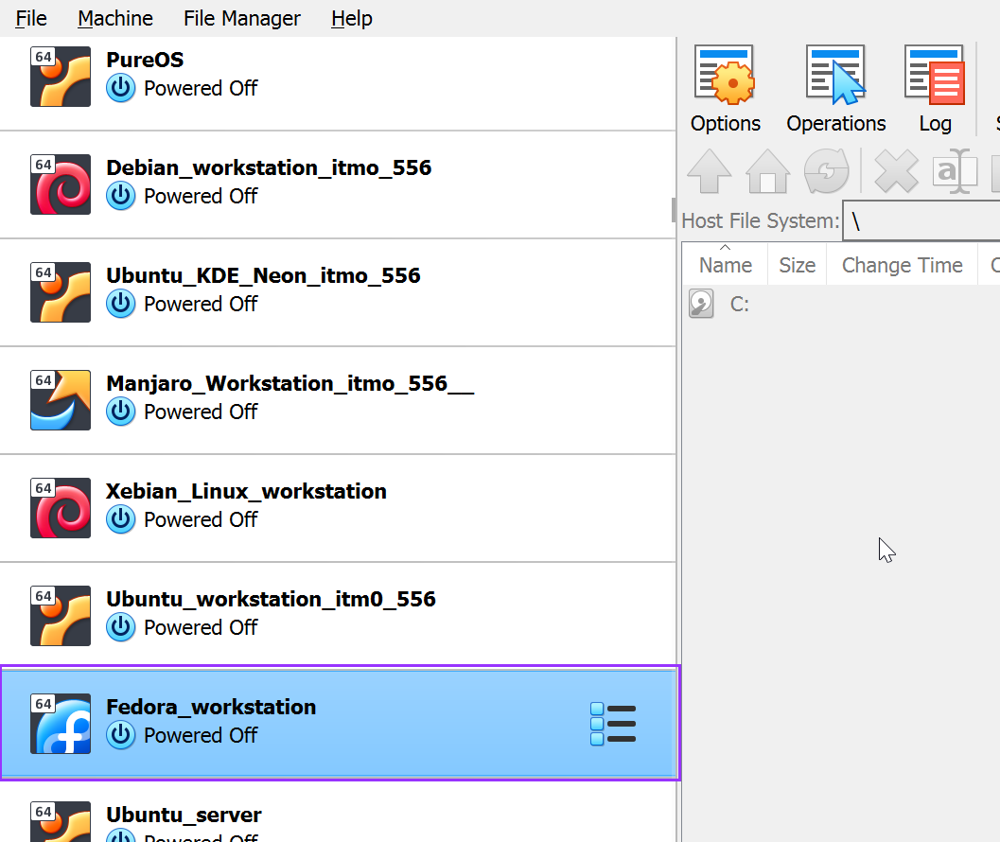
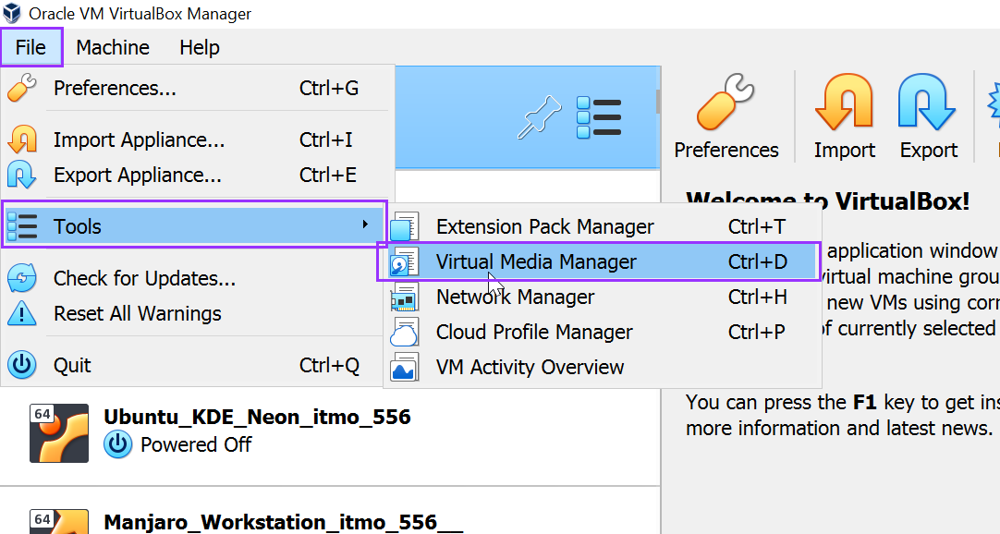
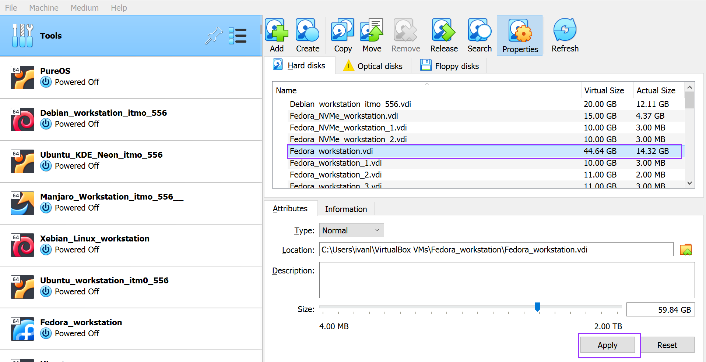

# Increasing disk size

Before

Steps
1. Backup Your Data
Before making any changes, it's crucial to back up your data to prevent data loss in case of unforeseen issues.

On Your Virtual Box, navigate to your fedora VM whose size needs to be increased. 

On the files menu, navigate to Tools -->Vitaul Media Manager

On the vitual media manager window, I looked for my fedora VM vdi image and increased the disk space from 15G to 45G.  

I started my VM, and on typing the command df -H to check for disk size, it was still the same

I installed growpart tool to grow my parttion 3

